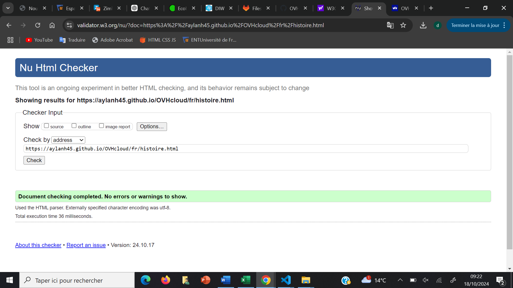
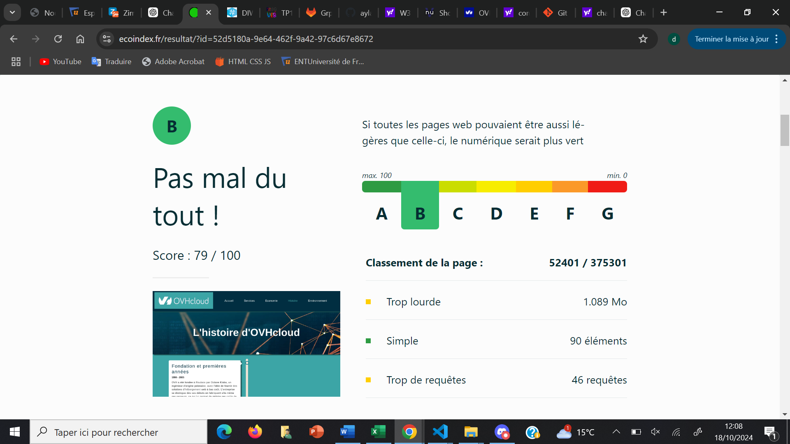
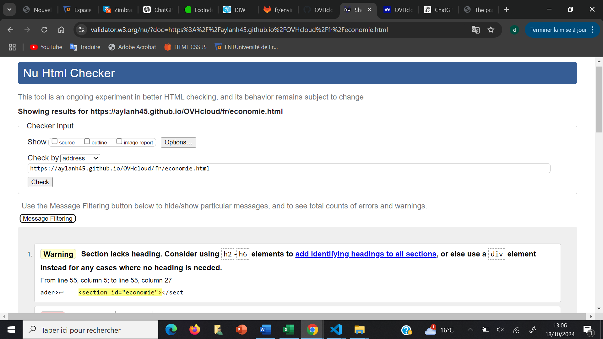
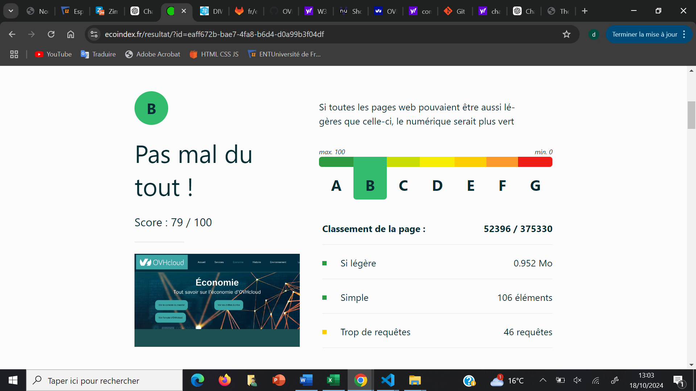
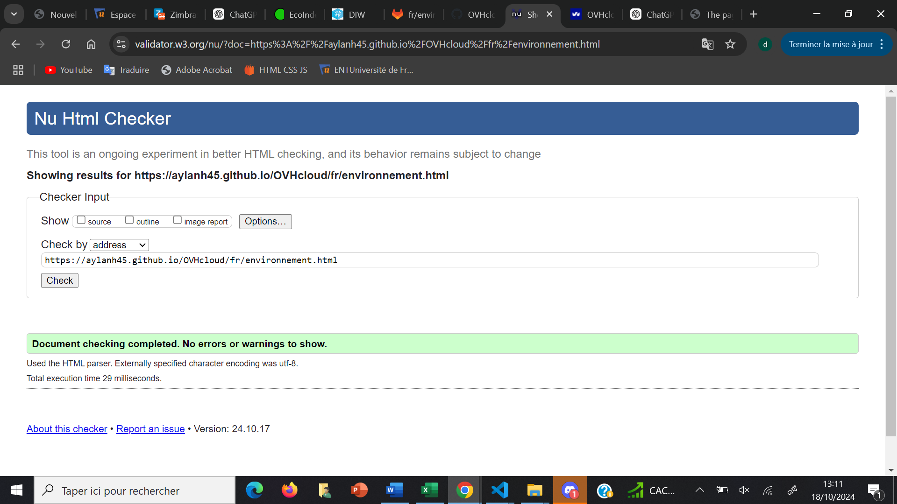
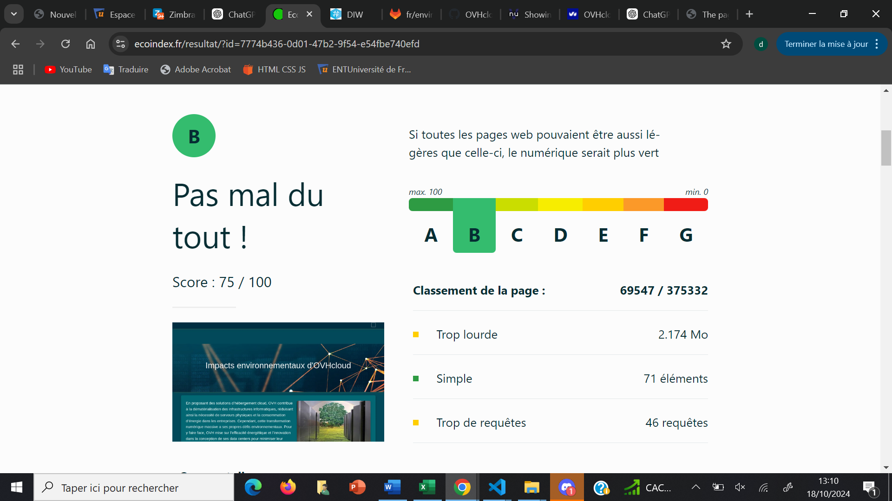
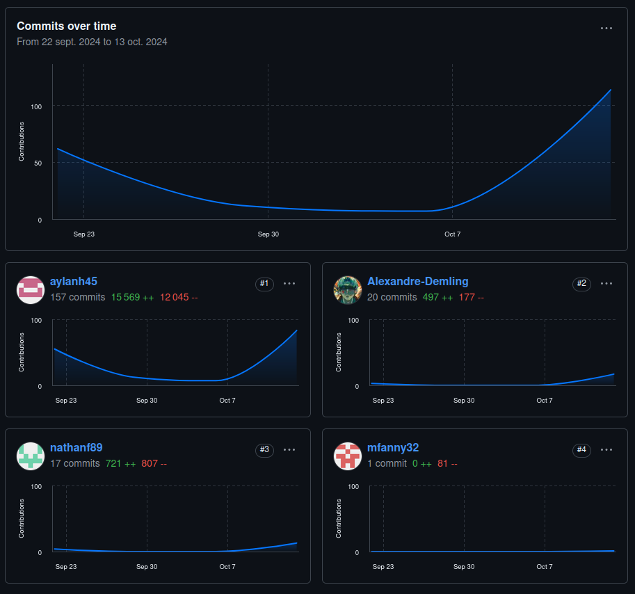

# Site présentation OVH 

## OVHcloud

[OVHcloud](https://aylanh45.github.io/OVHcloud/)

## Membres du groupe :

Etudiant 1 (référent du groupe) :  [HADDOUCHI Aylan](mailto:ahaddou2@edu.univ-fcomte.fr?subject=SAE_1_05_06)  
Etudiant 2 : [FOUCAULT Nathan](mailto:nfoucaul@edu.univ-fcomte.fr?subject=SAE_1_05_06)   
Etudiant 3 : [DEMLING Alexandre](mailto:ademling@edu.univ-fcomte.fr?subject=SAE_1_05_06)  
Etudiant 4 : [FANNY Moustapha #](mailto:mfanny@edu.univ-fcomte.fr?subject=SAE_1_05_06)

# Présentation du projet

Notre projet est de créer un site internet mettant en valeur l'impact économique, environnemental ainsi que l'histoire de la société OVHcloud.
Ce site sera sous forme de vitrine et disposera également d'une traduction en anglais.

## Choix de conception  

Pour la conception du site, nous nous sommes grandement inspirés du site officiel de OVHcloud (disponible [ici](https://www.ovhcloud.com/fr/)).

## Développement Site Web et Validation des pages

### Page d'accueil

**Auteur : Haddouchi Aylan**  

Vérification W3C : [Détail ICI](https://validator.w3.org/nu/?doc=https%3A%2F%2Faylanh45.github.io%2FOVHcloud%2Findex.html)

<!--  style="width=400px" ne fonctionne pas -->

### Page services

**Auteur : Haddouchi Aylan**  

Vérification W3C : [Détail ICI](https://validator.w3.org/nu/?doc=https%3A%2F%2Faylanh45.github.io%2FOVHcloud%2Ffr%2Fservices.html)

<!--  style="width=400px" ne fonctionne pas -->

### Page histoire

**Auteur : Demling Alexandre**  

Vérification W3C : [Détail ICI](https://validator.w3.org/nu/?doc=https%3A%2F%2Faylanh45.github.io%2FOVHcloud%2Ffr%2Fhistoire.html)

<!--  style="width=400px" ne fonctionne pas -->
### Page histoire

**Auteur : Foucault Nathan**  

Vérification W3C : [Détail ICI](https://validator.w3.org/nu/?doc=https%3A%2F%2Faylanh45.github.io%2FOVHcloud%2Ffr%2Feconomie.html)

<!--  style="width=400px" ne fonctionne pas -->

### Page environnement

**Auteur : Fanny Moustapha**  

Verification W3C : [Détail ICI](https://validator.w3.org/nu/?showsource=yes&showoutline=yes&showimagereport=yes&doc=https%3A%2F%2Faylanh45.github.io%2FOVHcloud%2Ffr%2Fenvironnement.html)

 

 

## Répartition du travail

### Planification - Diagramme de GANTT

- Foucault Nathan
- Demling Alexandre
- Haddouchi Aylan

### Recherches d'informations

- Foucault Nathan
- Demling Alexandre
- Haddouchi Aylan
- Fanny Moustapha

### Rapport économique

- Foucault Nathan
- Demling Alexandre
- Haddouchi Aylan
- Fanny Moustapha

### Développement site

- Haddouchi Aylan
  - Page d’accueil
  - "Template" de page (Navbar/Footer)
  - Page services
  - Correction des pages pour W3C
  - Hébergement Github, Bitbucket et Gitlab 
  - Traduction en anglais

- Demling Alexandre
  - Page histoire
  - Hébergement Gitlab
  - Traduction en anglais

- Foucault Nathan
  - Page economie
  - Hébergement Bitbucket
  - Traduction en anglais

- Fanny Moustapha
  - Page environnement
  - Traduction en anglais

## Contributeurs

